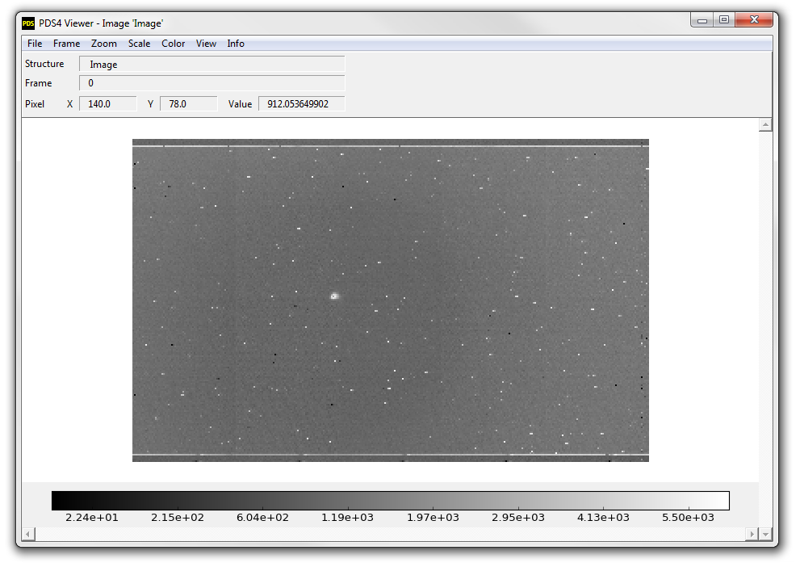
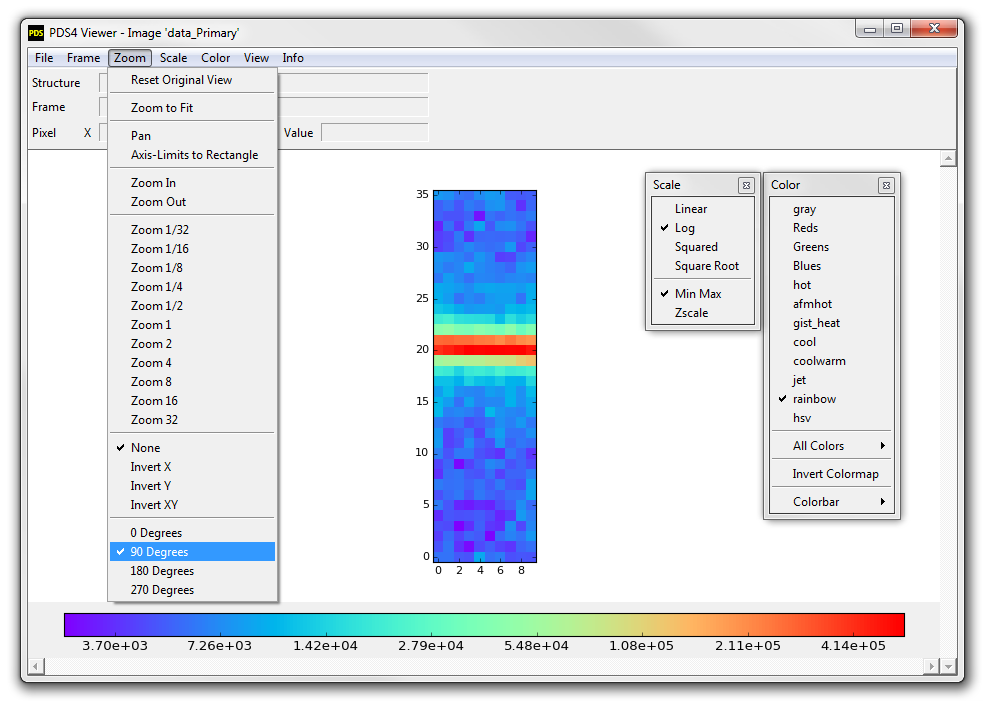
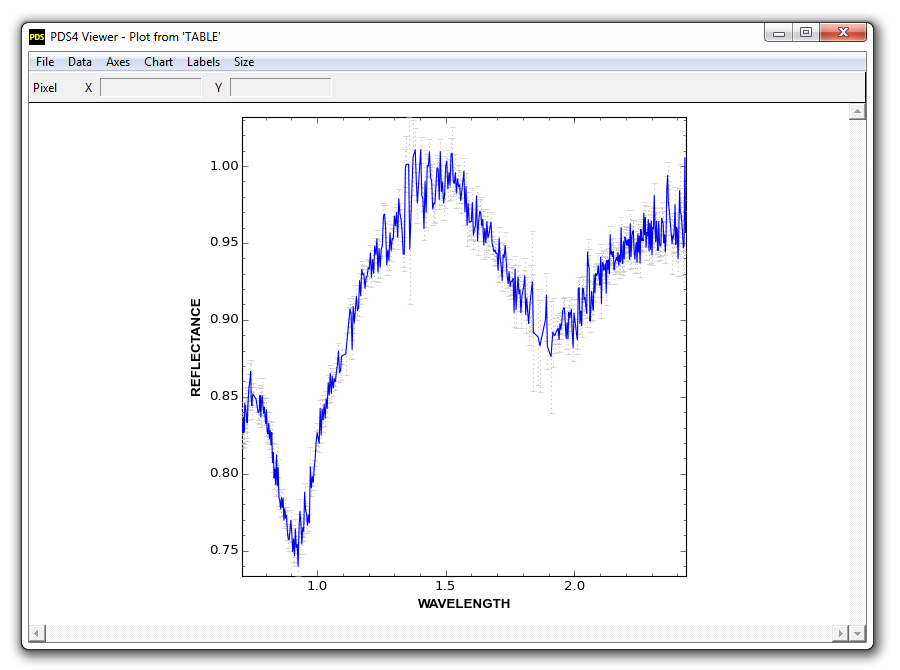
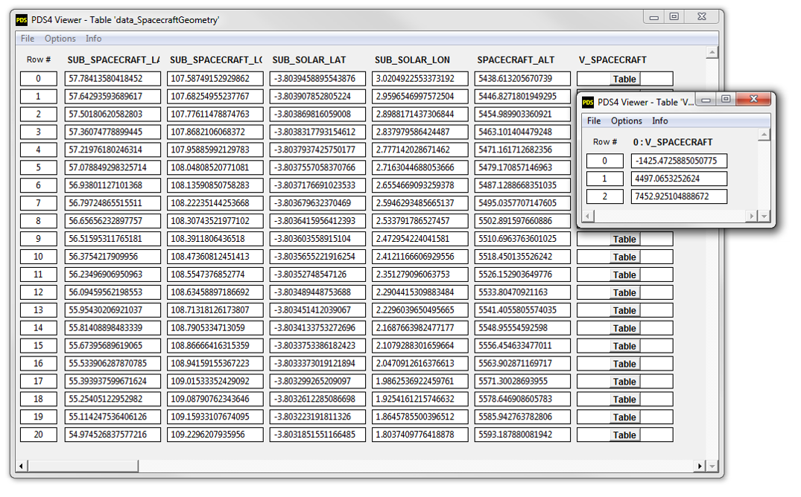
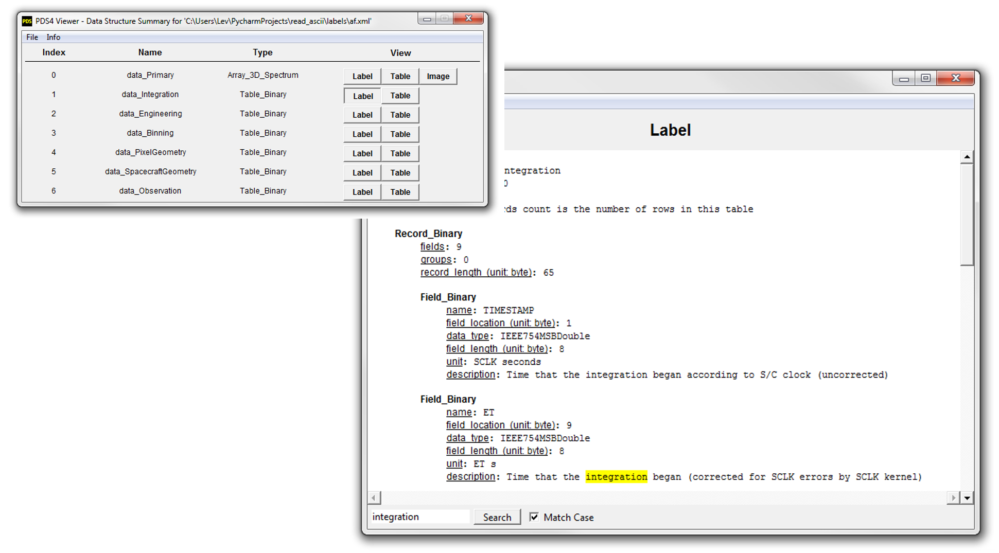

:orphan:

PDS4 Viewer
===========

PDS4 Viewer
-----------

* A read-in and visualization tool for PDS4 data
* Available stand-alone, no installation necessary, on Windows, Mac and Linux
* Supports all\ `** <#supported-data-structures>`_ PDS4 data (images, spectra,
  arrays, tables)

Features
--------

`See screenshots of the tool. <#screenshots>`_

* Summary View: displays a summary of the available data structures in the
  label, giving various options to view them

* Image View: displays N-dimensional images and spectra, allowing for zoom,
  rotation, pan, axis-inversion, colormap manipulation, scaling, etc.

* Table View: displays all PDS4 tables and arrays as tables, including
  arbitrarily nested GROUP fields (sub-tables).

* Plot View: allows plotting PDS4 table columns against each other, including
  error bars.

* Label View: Easy, human-readable, access to meta-data (such as structure
  labels, display settings and spectral characteristics, etc.)

Contact `Lev Nagdimunov <https://sbnwiki.asteroiddata.org/User:Lnagdi1.html>`__
with questions or comments regarding this tool, or report issues on
`GitHub <https://github.com/Small-Bodies-Node/pds4_tools>`_.

Download
--------

Latest version, 1.3, was released on October 10, 2021.

Windows
"""""""

| Windows 7, 8 and 10 are supported.
| Download for Windows 64-bit:
  `PDS4 viewer windows-1.3.zip <https://pdssbn.astro.umd.edu/toolsrc/pds4_viewer/1.3/PDS4_viewer_windows-1.3.zip>`__

Mac OS X
""""""""

| Mac OS X 10.13 (High Sierra) through 11 (Big Sur) are supported.
| Download for Mac OS X (newer):
  `PDS4 viewer mac10_13-1.3.zip <https://pdssbn.astro.umd.edu/toolsrc/pds4_viewer/1.3/PDS4_viewer_mac10_13-1.3.zip>`__

| Mac OS X 10.6 (Snow Leopard) through 10.12 (Sierra) are supported.
| Download for Mac OS X (older):
  `PDS4 viewer mac10_6-1.3.zip <https://pdssbn.astro.umd.edu/toolsrc/pds4_viewer/1.3/PDS4_viewer_mac10_6-1.3.zip>`__.

\**Mac OS X 10.14.6 is currently unsupported, due to a significant upstream bug.

Linux
"""""

| RedHat 7+, CentOS 7+, Fedora 19+, Ubuntu 13+, Mint 15+, Debian 8+,
  openSUSE 13+ are supported.
| Download for Linux (newer) 64-bit:
  `PDS4 viewer centos7-1.3.zip <https://pdssbn.astro.umd.edu/toolsrc/pds4_viewer/1.3/PDS4_viewer_centos7-1.3.zip>`__

| RedHat 6, CentOS 6, and potentially other older Linux distributions.
| Download for Linux (older) 64-bit:
  `PDS4 viewer centos6-1.3.zip <https://pdssbn.astro.umd.edu/toolsrc/pds4_viewer/1.3/PDS4_viewer_centos6-1.3.zip>`__

If you use a Linux distribution other than those above, and neither of the
above versions work for your distribution, you can run the viewer from Python,
available :doc:`here <python_pds4_tools>`.

Source
""""""

The source code, which is written in Python, is available for
:ref:`download <download_python_pds4_tools>`.

Installation
------------

Windows
"""""""

Extract the ZIP file. Double click on "``pds4_viewer.exe``".

On newer Windows versions a Security Warning may popup. Click 'Run' or click
'More Info' and then 'Run' to ignore the warning.

Mac OS X
""""""""

Extract the ZIP file. Double click on "``pds4_viewer.app``".

On newer OS X versions a Security Warning may popup, which will not allow you
to proceed. Instead hold the 'Control' key, then click on the app icon again
and choose 'Open' from the shortcut window.

Linux
"""""

Extract the ZIP file. Add permissions to execute (via "``chmod +x pds4_viewer``")
and then double click on "``pds4_viewer``" or run it from command line.

An 'Operation not permitted' error can be emitted when /tmp is mounted as noexec;
use this `workaround <https://pyinstaller.readthedocs.io/en/stable/when-things-go-wrong.html?highlight=noexec#operation-not-permitted-error>`__.

Supported Data Structures
-------------------------

| PDS4 Data Standards >= v1.0 are supported.
| PDS3 Data Standards are not supported.

The table below lists the main PDS4 data structures and the current status.

.. list-table::
   :widths: 25 25 25 25 25
   :header-rows: 1

   * - Structure
     - Read-in
     - Display as Table
     - Display as Image
     - Display Columns as Plot
   * - Header
     -  Yes
     -  No
     -  No
     -  No
   * - Array
     - Yes
     - Yes
     - Yes, N-dims
     - Yes, 1-D only
   * - Array_2D
     - Yes
     - Yes
     - Yes
     - No
   * - Array_2D_*
     - Yes
     - Yes
     - Yes
     - No
   * - Array_3D
     - Yes
     - Yes
     - Yes
     - No
   * - Array_3D_*
     - Yes
     - Yes
     - Yes
     - No
   * - Table_Character
     - Yes
     - Yes
     - No
     - Yes
   * - Table_Binary
     - Yes, except BitFields
     - Yes
     - No
     - Yes
   * - Table_Delimited
     - Yes
     - Yes
     - No
     - Yes
   * - Composite_Structure
     - No
     - No
     - No
     - No

Screenshots
-----------

   PDS4 Viewer's Image View

   PDS4 Viewer's Image View (additional options shown)

   PDS4 Viewer's Plot View

   PDS4 Viewer's Table View

   PDS4 Viewer's Label Summary and Label View